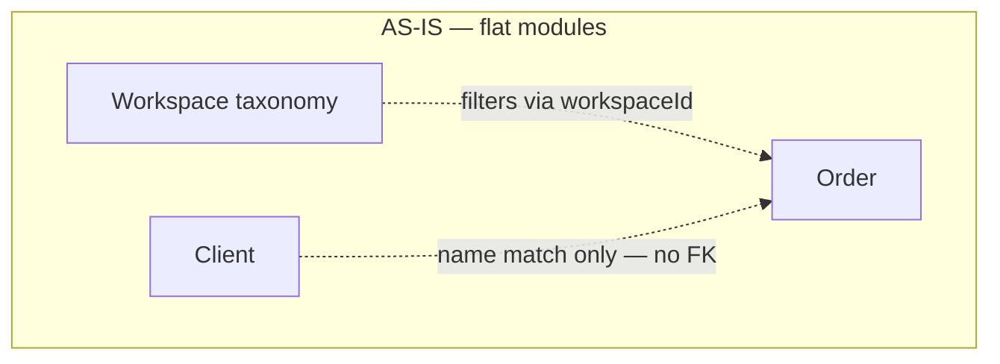
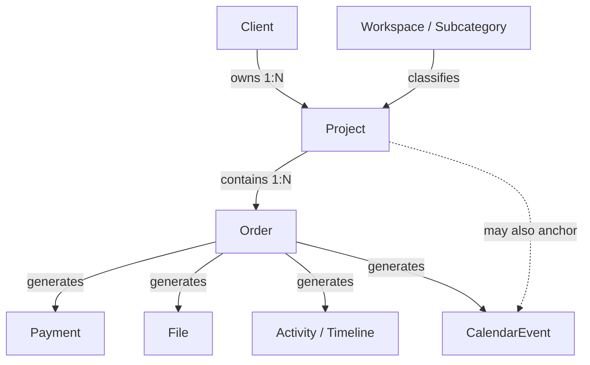
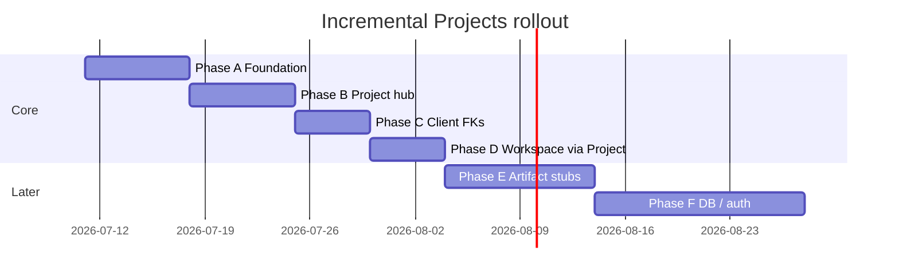
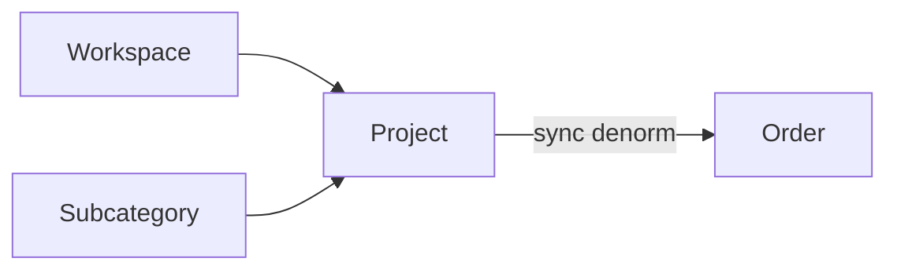
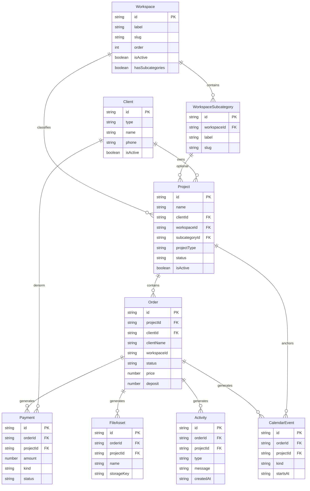

# SODA OS — Projects-Centered Architecture

**Status:** Proposed — awaiting product owner approval  
**Date:** 2026-07-10  
**Scope:** Architecture & migration plan only (no application code in this deliverable)  
**Codebase:** `C:\Users\ahmed\soda-os` (Next.js App Router, mock/in-memory data)

---

## AS-IS architecture (grounded in the repo)

### What exists today

| Area | Reality |
|------|---------|
| **Routes** | `/` dashboard, `/orders`, `/clients` (`app/page.tsx`, `app/orders/page.tsx`, `app/clients/page.tsx`) |
| **Shell** | `AppShell` for Orders/Clients; Dashboard still composes `Sidebar` + `Header` inline |
| **Nav** | Live: Dashboard, Orders, Clients. Stubbed (`href: "#"`): Projects, Weddings, Calendar, Finance, Settings (`components/layout/sidebar.tsx`) |
| **Orders** | Full CRUD-ish list UI: search, status filter, add dialog, table. State = `useState(mockOrders)` in `OrdersContent` |
| **Taxonomy (Phase 2)** | `lib/taxonomy` workspaces + subcategories. Orders UI: `WorkspaceTabs` + RTM-only `WorkspaceSidePanel`. Filter via `Order.workspaceId` / `Order.subcategoryId` |
| **Clients** | List + type filter + add dialog. `Client` has `id`, `type`, contact fields. **No FK from Order → Client** |
| **Dashboard** | Hardcoded widgets (`KPIGrid`, `RecentOrders`, `CalendarWidget`, `RevenueChart`) — not wired to `lib/orders` or `lib/clients` |
| **Persistence** | Mock arrays + client-side state. Clients have a thin `repository.ts`; Orders do not. No Supabase yet |

### Current `Order` shape (`lib/orders/types.ts`)

Operational booking fields **and** what should become Project context are mixed on one record:

- **Identity / display:** `id`, `clientName`, `phone`
- **Classification (Project-bound long-term):** `projectType`, `workspaceId`, `subcategoryId?`
- **Execution:** `shootDate`, `location`, `deliveryDate`, `team`, `status`, `notes`
- **Money (Payment precursors):** `price`, `deposit`

### Current `Client` shape (`lib/clients/types.ts`)

CRM person/company: `id`, `type`, `name`, `phone`, `email?`, `contactPerson?`, `company?`, `notes?`, `createdAt`, `isActive`.  
`getOrdersCountByClient(clientId, orderClientIds)` already anticipates a future `clientId` on orders — unused by UI today.

### Taxonomy (`lib/taxonomy`)

Workspaces: `rtm`, `weddings`, `fashion`, `product`, `events`, `commercial` (+ subcategories for RTM, Weddings, Commercial).  
Repository: `getWorkspaces`, `getSubcategories`, etc. Seed data in `seed-data.ts`.

### Domain gap

There is **no Project entity**. “Project Type” on Order is a shoot genre enum, not a Project record. Sidebar “Projects” and dashboard “Active projects” KPI are placeholders. Payments, Files, Activities, and Calendar events do not exist as models.



---

## Target domain model

### Hierarchy (product owner)



**Canonical reading:** Workspace organizes Projects; Client owns Projects; Project contains Orders; Orders are the source of operational artifacts (money, files, timeline, most calendar items).

### Entity definitions

| Entity | Definition |
|--------|------------|
| **Workspace** | Studio vertical / production lane (`rtm`, `weddings`, …). Already in `lib/taxonomy/types.ts`. |
| **WorkspaceSubcategory** | Optional lane within a workspace (e.g. RTM → Future City). |
| **Client** | Person or company who **owns** work. Not a folder. CRM record in `lib/clients`. |
| **Project** | **Central engagement container.** One client engagement in one workspace (e.g. “Ahmed Ali — Wedding 2026”, “Galaxy — Q1 RTM”). Owns classification (`workspaceId`, `subcategoryId?`, `projectType`) and client link. |
| **Order** | **Bookable / executable unit** inside a Project (shoot day, package line, deliverable batch). Carries status pipeline, team, location, dates, commercial amounts. |
| **Payment** | Money movement against an Order (deposit, installment, final, refund). Derived from today’s `price`/`deposit` over time. |
| **File** | Asset or document linked to an Order (and visible rolled up on Project). |
| **Activity / TimelineEvent** | Audit / ops note tied primarily to Order (optionally Project for project-level notes). |
| **CalendarEvent** | Scheduled occurrence derived from Order dates (shoot, delivery) or Project milestones; later also manual studio events. |

### Recommended `Project` fields (target)

```ts
// Conceptual — not implemented in this doc
interface Project {
  id: string;                    // e.g. PRJ-2026-0001
  name: string;                  // display title
  clientId: string;              // required owner
  workspaceId: string;           // primary taxonomy attach
  subcategoryId?: string;
  projectType: ProjectType;      // reuse enum from lib/orders/types.ts
  status: ProjectStatus;         // Active | OnHold | Completed | Cancelled
  primaryOrderId?: string;       // optional convenience for 1-order projects
  notes?: string;
  createdAt: string;
  updatedAt: string;
  isActive: boolean;             // soft-delete
}
```

### Recommended `Order` evolution

```ts
interface Order {
  id: string;
  projectId: string;             // NEW — required after migration
  // Transition (keep until UI fully joins Project):
  clientId?: string;             // denormalized from Project.clientId
  clientName: string;            // denormalized display — keep for Orders table
  phone: string;                 // denormalized — keep for Orders table
  projectType: ProjectType;      // denormalized — keep column working
  workspaceId: string;           // denormalized cache — Phase 2 filters keep working
  subcategoryId?: string;        // denormalized cache
  // Execution (stay on Order):
  shootDate: string;
  location: string;
  deliveryDate: string;
  price: number;                 // until Payment module: commercial total
  deposit: number;               // until Payment module: recorded deposit
  team: string;
  status: OrderStatus;
  notes: string;
}
```

**Decision:** Prefer **denormalized copies on Order during migration** so `/orders` (tabs, table, add dialog) needs only additive fields — not a rewrite. Long-term source of truth for workspace/client/type is **Project**; Order copies are synced on write.

---

## 1. Complete implementation plan

Incremental migration. **No big-bang rewrite.** Dashboard, Orders, and Clients UIs stay functional at every phase.

### Phase A — Domain foundation (Projects MVP data + list)

**Deliverables**

- `lib/projects/{types,mock-data,repository,utils}.ts`
- Backfill: one Project per existing mock Order (see §2)
- Additive Order fields: `projectId`, optional `clientId`
- Route `/projects` list (AppShell), sidebar link live
- Workspace tabs on Projects list (reuse `WorkspaceTabs` / filter pattern)
- Create Project dialog (client picker + workspace + type + name)

**Unchanged**

- `/`, `/orders`, `/clients` behavior and columns
- Phase 2 Orders workspace tabs/panel filtering (still on `Order.workspaceId`)
- Clients module UI

**Additive only**

- New module + nav; Orders gain optional FKs behind the scenes

### Phase B — Project hub + Order linkage in UI

**Deliverables**

- `/projects/[id]` hub: header, orders list for that project, stubs for Payments/Files/Timeline sections
- Add Order: optional “attach to existing Project” or “create Project + Order”
- Orders table: “View project” deep link when `projectId` present
- Clients: “Projects” count / link (read-only list filter `?clientId=`) — no Clients redesign

**Unchanged**

- Orders filters, status pipeline, add-order required fields (may add Project picker as optional then required)

### Phase C — Client identity hardening

**Deliverables**

- Resolve `clientName` → `clientId` for all mock rows; keep `clientName` as denormalized label
- Add Order dialog: Client select (from `getClients()`) instead of free-text name (phone autofill from Client)
- Clients repository: real `getProjectCountByClient` / orders-via-projects helpers

**Unchanged**

- Clients table columns; Orders table still shows client name string

### Phase D — Workspace truth moves to Project

**Deliverables**

- Writes always set Project.workspaceId; Order.workspaceId synced from Project
- Orders filter optionally joins: `filter via project.workspaceId` with fallback to Order fields
- Extend side panel beyond RTM for workspaces with `hasSubcategories` (Weddings, Commercial) — **optional UX polish, not a redesign**

**Unchanged**

- Tab/panel components’ visual language

### Phase E — Artifacts (architecture-ready stubs → thin implementations)

**Deliverables (thin, not full products)**

- `Payment`, `File`, `Activity`, `CalendarEvent` types + mock repos
- Project hub sections populated from Order-linked mocks
- Dashboard widgets optionally read shared libs (Recent Orders from `mockOrders`, KPI “Active projects” from projects repo)

### Phase F — Persistence & platform

- Supabase (or equivalent) schema matching §7
- Auth, RLS, storage buckets, realtime — see §11



---

## 2. How existing Orders migrate into Projects

### Strategy: **1 Order → 1 Project** (initial backfill)

Today every mock order is a self-contained engagement. Creating one Project per Order preserves all data without inventing multi-order groupings prematurely. Operators can later merge or add sibling orders under one Project in Phase B+.

**Alternative (not recommended for v1):** Group by `(clientName, workspaceId, projectType)` — collapses some rows but risks incorrect merges (e.g. two weddings for same name). Defer grouping to a manual “Merge projects” tool later.

### Field mapping

| Current `Order` field | Moves to | Stays on Order | Notes |
|----------------------|----------|----------------|-------|
| `id` | — | ✓ | Order id unchanged (`SODA-2026-xxxx`) |
| `clientName` | Project via `clientId` + denorm name | ✓ denorm | Match `Client.name` / `company` in mockClients |
| `phone` | Client (source of truth) | ✓ denorm | Prefer Client.phone after link |
| `projectType` | **Project** (canonical) | ✓ denorm | Enum stays in `lib/orders/types.ts` or move to `lib/projects` and re-export |
| `workspaceId` | **Project** (canonical) | ✓ denorm cache | Phase 2 filters keep working |
| `subcategoryId` | **Project** (canonical) | ✓ denorm cache | |
| `shootDate`, `location`, `deliveryDate` | — | ✓ | Execution |
| `price`, `deposit` | Future Payment rows | ✓ until Phase E | Seed Payment: deposit paid + balance due |
| `team`, `status`, `notes` | — | ✓ | Order pipeline |

### Project naming rule (backfill)

```
name = `${clientName} — ${projectType}`
// e.g. "Ahmed Ali — Wedding", "Galaxy Company — Commercial"
```

If duplicate names appear later, append year from `shootDate` or short id suffix.

### Client resolution rule

1. Exact match `Order.clientName` → `Client.name` or `Client.company` (case-sensitive first, then case-insensitive).
2. If match: set `Project.clientId` and `Order.clientId`.
3. If no match: create a **shadow Client** (`isActive: true`, type inferred: company-like names vs individual) **or** leave `clientId` unset and keep `clientName` only — **Recommendation:** create missing clients in mock backfill so every Project has an owner (mock data already covers most names; Palm Hills, Wav Studios, Dr. Hana, etc. may need new Client rows).

### Mock backfill algorithm

```
for each order in mockOrders:
  clientId = resolveOrCreateClient(order.clientName, order.phone)
  project = {
    id: PRJ-2026-{nnnn},
    name: `${order.clientName} — ${order.projectType}`,
    clientId,
    workspaceId: order.workspaceId,
    subcategoryId: order.subcategoryId,
    projectType: order.projectType,
    status: mapOrderStatusToProjectStatus(order.status),
    primaryOrderId: order.id,
    createdAt: order.shootDate or fixed seed,
    isActive: order.status !== 'Cancelled' or true with status Cancelled
  }
  order.projectId = project.id
  order.clientId = clientId
  // keep all existing order fields
```

**Status mapping (Project):**

| Order status | Project status |
|--------------|----------------|
| Pending, Scheduled, Shooting, Editing | `Active` |
| Delivered | `Completed` |
| Cancelled | `Cancelled` |

### Future DB backfill

Same rules as SQL/ETL: insert projects, update orders set `project_id`, backfill `client_id`, keep denormalized columns until dual-write period ends. Add CHECK/trigger later: `orders.workspace_id` must equal parent project’s workspace (or drop order columns).

### Compatibility with existing Orders UI

| Surface | Impact |
|---------|--------|
| `filterOrders` | Unchanged — still uses Order.workspaceId / subcategoryId / status / search |
| `OrdersTable` | Unchanged columns; optional later column “Project” |
| `AddOrderDialog` | Phase A: on submit, auto-create Project + set `projectId` (invisible to user). Phase C: client picker. Phase B: optional project picker |
| Workspace tabs/panel | Unchanged behavior |

---

## 3. How Clients connect to Projects

### Ownership model

- **Client 1 — N Project** (required `Project.clientId`)
- Clients are **owners**, not containers/folders. UI: Client detail later shows “Projects owned”; never nest Clients under Workspaces.

### Replacing free-text `clientName`

| Stage | Behavior |
|-------|----------|
| **Now** | Order.clientName only |
| **Phase A** | Project.clientId required; Order.clientName kept; Order.clientId optional |
| **Phase C** | Add Order requires Client select; writes Client.name → Order.clientName for display |
| **Later** | UI may read `getClientDisplayName(client)` via join; column still shows a string |

**Do not remove `clientName` from Order** until every consumer (table, dashboard, search) joins Clients. Search can include both.

### Ownership vs contact roles

**v1:** Single owner (`clientId`) is enough.  
**v2 (out of MVP):** `ProjectContact` join (`projectId`, `clientId` or person, `role`: Owner | Planner | OnSite) for weddings with couple + planner. Do not block Projects MVP on this.

### Clients UI

- No redesign of `ClientsContent` / table.
- Additive: row action “View projects” → `/projects?clientId=client-001`.
- Repository already hints at counts via `getOrdersCountByClient` — prefer counting **Projects** for Clients KPI, and Orders via projects for operational counts.

---

## 4. How Workspaces connect to Projects

### Long-term rule

**Workspace (and subcategory) attach primarily to Project.**  
Orders **inherit** workspace context: `order.workspaceId === project.workspaceId` (synced).



### Compatibility with Phase 2 Orders UI

- **Short term:** Keep filtering on `Order.workspaceId` / `Order.subcategoryId` (already wired in `orders-content.tsx`).
- **Medium term:** `filterOrders` may resolve workspace via `projectsById.get(order.projectId).workspaceId` with fallback to order fields.
- **Write path:** Changing a Project’s workspace updates all child orders’ denormalized fields (single function `syncOrderTaxonomyFromProject`).

### Projects list filtering

Reuse the same `WorkspaceTabs` + side panel pattern on `/projects` so studio mental model stays consistent. Filter key: `Project.workspaceId` (canonical).

### Sidebar “Weddings”

Treat as a **saved filter** / deep link: `/projects?workspaceId=weddings` (or `/orders?workspaceId=weddings`) — not a separate domain entity. Out of Projects MVP; wire when Projects list ships.

---

## 5. How Calendar will use Projects

**No full Calendar build in first Projects sprint** — model only.

### Entity sketch

```ts
interface CalendarEvent {
  id: string;
  title: string;
  startsAt: string;          // ISO
  endsAt?: string;
  kind: "shoot" | "delivery" | "milestone" | "internal";
  projectId?: string;
  orderId?: string;          // preferred for shoot/delivery
  workspaceId?: string;      // denorm for calendar filters
  team?: string;
  location?: string;
  source: "derived" | "manual";
}
```

### Derivation rules

| Source | Event |
|--------|--------|
| Order.shootDate | `kind: "shoot"`, title from Project.name or `${clientName} shoot` |
| Order.deliveryDate | `kind: "delivery"` |
| Project milestone (future) | `kind: "milestone"`, `orderId` null |
| Studio meeting (future) | `manual`, optional project link |

### UI trajectory

1. Replace hardcoded `calendar-widget.tsx` events with derived list from orders/projects.
2. Full `/calendar` route: month/week views filtered by workspace / team / project.
3. Click-through: event → `/projects/[id]` or `/orders` highlight.

**Projects matter for Calendar** as the grouping label and workspace filter dimension; **Orders** remain the primary date source for shoots/deliveries.

---

## 6. How Finance will use Projects

**No full Finance build** — rollup architecture only.

### Payment entity sketch

```ts
interface Payment {
  id: string;
  orderId: string;           // required — money attaches to Order
  projectId: string;         // denorm for rollup
  clientId: string;          // denorm
  workspaceId: string;       // denorm
  amount: number;
  currency: "EGP";
  kind: "deposit" | "installment" | "final" | "refund";
  status: "pending" | "paid" | "failed" | "waived";
  paidAt?: string;
  note?: string;
}
```

### Seed from current Order fields

- Payment 1: `kind: "deposit"`, `amount: order.deposit`, `status: "paid"` (assume recorded)
- Payment 2 (optional): `kind: "final"`, `amount: order.price - order.deposit`, `status: order.status === "Delivered" ? "paid" : "pending"`

Keep `Order.price` / `Order.deposit` as **commercial terms** (quoted total / required deposit) even after Payments exist — Payments are **actuals**.

### Rollup dimensions

| Dimension | Path |
|-----------|------|
| Order | Σ payments where orderId |
| Project | Σ via projectId / child orders |
| Client | Σ via clientId |
| Workspace | Σ via workspaceId (studio P&L by lane) |

Dashboard `RevenueChart` / Finance module should aggregate **paid** payments by month, with filters on workspace and client — Project is the natural drill-down hub (`/projects/[id]` payment summary).

---

## 7. Database relationships

### ER diagram



### Cardinalities & delete rules

| Relation | Cardinality | Delete / soft-delete |
|----------|-------------|----------------------|
| Client → Project | 1:N | Soft-deactivate Client; block hard delete if active Projects |
| Project → Order | 1:N | Soft-deactivate Project; cascade soft-delete flag to orders **or** block if open orders |
| Order → Payment/File/Activity/CalendarEvent | 1:N | Soft-delete Order hides children; hard delete only in admin purge |
| Workspace → Project | 1:N | Workspaces are taxonomy — deactivate, don’t delete if projects reference |

### Mock vs Supabase

| Now | Later |
|-----|--------|
| `lib/*/mock-data.ts` + in-memory `useState` | Supabase tables mirroring ER |
| `lib/clients/repository.ts`, `lib/taxonomy/repository.ts` | Same function signatures → Supabase implementations |
| No orders repository | Add `lib/orders/repository.ts` + `lib/projects/repository.ts` before DB cutover |

Introduce DB when dual-writing becomes painful (approx. Phase F), not before Projects MVP proves the model in mock.

---

## 8. Routing structure

### Proposed App Router map

| Route | Role |
|-------|------|
| `/` | Dashboard — **keep** |
| `/orders` | Global orders list + workspace tabs — **keep** |
| `/clients` | Clients list — **keep** |
| `/projects` | Projects list (workspace tabs, search, status) — **new hub list** |
| `/projects/[id]` | **Project hub** (primary detail surface) |
| `/projects/[id]/orders` | Optional segment or tab — orders for project |
| `/projects/[id]/payments` | Stub → Finance slice |
| `/projects/[id]/files` | Stub |
| `/projects/[id]/timeline` | Stub |
| `/calendar` | Future |
| `/finance` | Future |
| `/settings` | Future |

**Decision:** Use **query tabs or client sections** on `/projects/[id]` for MVP (one page, section nav) rather than many nested routes. Add nested routes when sections need independent URLs/share links.

### Deep links

- `/projects?workspaceId=rtm&subcategoryId=rtm-future-city`
- `/projects?clientId=client-003`
- `/projects/PRJ-2026-0001`
- `/orders?projectId=PRJ-2026-0001` (filter global orders list)
- From Orders row → `/projects/[projectId]`

### List vs hub

- **List pages:** `/projects`, `/orders`, `/clients` — scan, filter, create
- **Hub:** `/projects/[id]` — single engagement OS surface (orders + future artifacts)
- Order “detail” can remain light (sheet/dialog) or deep-link into project hub focused on that order — **recommend project hub as canonical detail** to avoid a third competing detail page

---

## 9. Reusable components

### Extract / share (cross-module)

| Component | From | Reuse |
|-----------|------|--------|
| `WorkspaceTabs` | `components/orders/` | Move to `components/taxonomy/` or `components/shared/` — used by Orders + Projects |
| `WorkspaceSidePanel` | `components/orders/` | Same |
| `AppShell` | `components/layout/` | Projects pages |
| Status badges | `order-status-badge` | Keep order-specific; add `project-status-badge` |
| Formatters | `formatPrice`, `formatDate`, `getInitials` | Consider `lib/format.ts` later — don’t churn now |
| **New:** `ClientPicker` | — | Add Order / Add Project |
| **New:** `ProjectPicker` | — | Add Order (attach) |
| **New:** `WorkspacePicker` | — | Add Project (explicit taxonomy, not only via projectType heuristic) |
| **New:** `EntityHeader` | — | Project hub title, client link, workspace chip, status |
| **New:** `ActivityTimeline` | — | Project hub + later Order sheet |
| **New:** `FileList` | — | Stub list UI |
| **New:** `PaymentSummary` | — | Totals + list |

### Keep module-local

- `OrdersTable`, `AddOrderDialog`, `OrdersContent`
- `ClientsTable`, `AddClientDialog`, `ClientsContent`
- Dashboard widgets until they read shared repos

### Shell pattern

Project hub layout: `EntityHeader` + horizontal section nav + section body. Do not invent a second app chrome.

---

## 10. Folder structure

Keep existing modules intact; add Projects and shared taxonomy UI.

```
app/
  page.tsx                 # dashboard — unchanged
  orders/page.tsx          # unchanged
  clients/page.tsx         # unchanged
  projects/
    page.tsx               # list
    [id]/page.tsx          # hub

components/
  layout/                  # unchanged
  dashboard/               # unchanged
  orders/                  # unchanged (may import shared taxonomy)
  clients/                 # unchanged
  taxonomy/                # NEW — move WorkspaceTabs, WorkspaceSidePanel here
  projects/                # NEW
    projects-content.tsx
    projects-table.tsx
    add-project-dialog.tsx
    project-header.tsx
    project-orders-section.tsx
    project-payments-section.tsx   # stub
    project-files-section.tsx      # stub
    project-timeline-section.tsx   # stub
  shared/                  # NEW — pickers, entity header, payment summary
    client-picker.tsx
    project-picker.tsx
    workspace-picker.tsx
    entity-header.tsx
  ui/                      # unchanged

lib/
  taxonomy/                # unchanged API
  clients/                 # unchanged + small helpers
  orders/                  # additive fields + optional repository
  projects/                # NEW
    types.ts
    mock-data.ts
    repository.ts
    utils.ts
    status-styles.ts
  payments/                # Phase E
  files/                   # Phase E
  activity/                # Phase E
  calendar/                # Phase E
```

**Do not** scatter Project types under `lib/orders`. Orders depend on Projects, not the reverse (except denormalized fields).

---

## 11. Future scalability

| Concern | Recommendation |
|---------|----------------|
| **Multi-tenant** | Add `organizationId` on all roots (Client, Project, Order, Workspace seeds per org) before second studio |
| **Auth** | Supabase Auth + RLS keyed by org/membership; delay until DB |
| **Realtime** | Supabase realtime on Order status / CalendarEvent for ops floor |
| **Storage** | Supabase Storage; `FileAsset.storageKey`; path `org/project/order/filename` |
| **Permissions** | Roles: Admin, Producer, Editor, Finance — gate Finance and file delete |
| **API boundary** | Today: client components + local state. Next: Server Actions or route handlers in `lib/*/repository` so UI doesn’t care about mock vs DB |
| **When to introduce DB** | After Phase B hub is stable and mock sync pain appears; migrate taxonomy + clients + projects + orders together |
| **Indexing** | `(organization_id, workspace_id)`, `(client_id)`, `(project_id)`, `(shoot_date)`, GIN/trgm on names for search |
| **Search** | Start with in-memory filters; later Postgres `tsvector` across Project.name, Client.name, Order.id |

---

## What is explicitly out of scope (first Projects implementation sprint)

- Redesigning Dashboard, Orders table, or Clients UI
- Full Calendar or Finance modules
- Real file uploads / storage
- Auth, multi-tenant, Supabase
- Merging multiple existing orders into one Project automatically
- Project contact roles / multi-owner
- Replacing sidebar “Weddings” with a custom module
- Removing `clientName` / Order taxonomy denorm fields
- Rewriting Phase 2 tabs to filter only via Project joins
- Activity feed productization, notifications system

---

## Risks & migration pitfalls

| Risk | Mitigation |
|------|------------|
| **Dual source of truth** (Order vs Project workspace/client) | Single write helper; denorm sync; eventually constrain DB |
| **Orphan orders** without `projectId` | Backfill all mocks in Phase A; Add Order always creates/links Project |
| **Client name collisions** | Prefer explicit Client picker; fuzzy match only in one-time backfill with review list |
| **1:1 Project–Order feels redundant** | Accept for migration; value appears when second order (album reprint, extra shoot) attaches to same Project |
| **Dashboard drift** | Hardcoded widgets will disagree with Projects until Phase E wiring |
| **RTM-only side panel** | Document as Phase 2 limitation; extend when Projects list needs Weddings/Commercial subs |
| **`projectType` vs Project entity naming** | Keep enum name `ProjectType` for genre; entity is `Project` — document in types to avoid confusion |
| **Price on Order vs Payments** | Treat price/deposit as terms; don’t delete when adding Payment actuals |

---

## Recommended first implementation slice (MVP after approval)

**Smallest valuable slice = Phase A only:**

1. Add `lib/projects` types, mock backfill (1:1 from `mockOrders`), repository.
2. Extend `Order` with `projectId` (+ optional `clientId`); update `mock-data.ts` accordingly; ensure missing clients exist in `mockClients`.
3. Ship `/projects` list with search + workspace tabs (reuse taxonomy components) + add-project dialog.
4. Point sidebar “Projects” to `/projects`.
5. On Add Order submit: auto-create matching Project (invisible) so new rows stay consistent — **no Orders UI redesign**.

**Success criteria:** Every order has a project; user can browse projects by workspace; Orders/Clients/Dashboard still work unchanged.

---

## Decision summary

| Topic | Decision |
|-------|----------|
| Core entity | **Project** — client-owned, workspace-classified, contains orders |
| Backfill | **1 Order → 1 Project** |
| Taxonomy home | **Project** (Order keeps denorm for Phase 2 compatibility) |
| Client link | **Project.clientId** required; Order.clientName retained |
| Money/files/timeline/calendar | **Order-generated**; roll up through Project |
| First ship | **Projects list + data model + silent link on create order** |
| Persistence | Stay mock until hub + model proven |

---

*End of architecture document. No application code changes are implied by approval of this document alone; implementation begins only after explicit go-ahead on the Phase A slice.*
